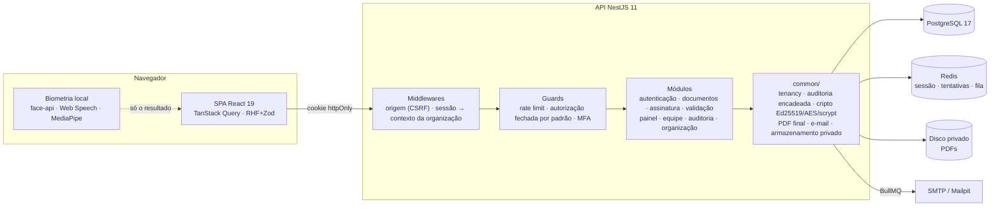

<div align="center">

# ✍️ LetsSign

**Assinatura eletrônica avançada com verificação de identidade biométrica, criptografia Ed25519 e trilha de auditoria à prova de adulteração.**


Projeto acadêmico — **FIAP**

</div>

---

## O que é

O LetsSign é uma plataforma completa de assinatura de documentos. Não é um PDF com uma imagem colada:
cada assinatura é **criptografia verificável**, amarrada ao conteúdo exato do arquivo e à identidade
comprovada de quem assinou.

```
Enviar o PDF ──▶ Convidar quem assina ──▶ Provar a identidade ──▶ Assinar ──▶ PDF selado + QR Code
  (SHA-256)        (link único por e-mail)   (e-mail · rosto ·        (Ed25519)     (validação pública
                                              voz · gestos)                          por qualquer pessoa)
```

### Destaques

| | |
|---|---|
| 🔐 **Assinatura Ed25519** | Cada assinatura é uma assinatura digital de curva elíptica (RFC 8032) sobre uma carga JSON canônica que contém o hash do PDF, a identidade e as verificações. A chave pública é publicada. |
| 🧬 **Biometria sem armazenar biometria** | Rosto com prova de vida (piscar e virar a cabeça, via *eye aspect ratio* e marcos faciais — face-api), desafio de voz (Web Speech API) e sequência de gestos (MediaPipe). Tudo roda **no navegador**; o servidor só recebe o resultado — LGPD por desenho. |
| 🎲 **Desafios sorteados no servidor** | Palavras, gestos e ações de prova de vida são sorteados pela API e valem minutos. Uma gravação antiga ou um script que "inventa" o desafio não passa. |
| ⛓️ **Trilha encadeada por hash** | Todo evento guarda o hash do anterior — como uma blockchain privada. Editar ou apagar qualquer registro, **mesmo direto no banco**, é detectado. |
| 📄 **PDF final autoverificável** | Rodapé de validação em todas as páginas, manifesto de assinaturas com rubricas e QR Code, e um `letssign-evidencias.json` **embutido no PDF** com as cargas, as assinaturas e a chave pública. |
| 🔎 **Validação pública** | Qualquer pessoa confere a autenticidade pelo código, pelo QR Code ou arrastando o PDF — o hash é calculado no navegador; o arquivo não é enviado. |
| 🏢 **Multiempresa de verdade** | Isolamento por organização no servidor (AsyncLocalStorage + extensão do Prisma), com teste de isolamento como gate da suíte. |
| 🛡️ **Segurança em camadas** | Sessão server-side em Redis com cookie httpOnly, MFA TOTP com códigos de recuperação, RBAC por permissão, proteção CSRF, rate limit, CSP rígida, CPF e segredos cifrados com AES-256-GCM, senhas com scrypt. |

---

## Rodando localmente

**Pré-requisitos:** Node.js 22+ e Docker.

```bash
npm install          # instala os dois apps (npm workspaces)
cp apps/api/.env.example apps/api/.env
npm run setup        # sobe Postgres, Redis e Mailpit, aplica as migrations e popula a demonstração
npm run dev          # API em :3020 e SPA em :5190
```

| Endereço | O quê |
|---|---|
| http://localhost:5190 | O SPA (landing, app, assinatura, validação) |
| http://localhost:3020/api/saude/pronto | Health check da API |
| http://localhost:8035 | **Mailpit** — a caixa de entrada onde chegam os convites e os códigos de verificação |

### Pilha completa em containers (opcional)

Imagens de produção (API NestJS e SPA servido por nginx, na mesma origem):

```bash
npm run gerar-chave -w apps/api -- --existente   # copie a linha CHAVE_PRIVADA_ED25519=… para um .env na raiz
docker compose --profile app up --build         # SPA em http://localhost:8080
```

`--existente` reaproveita a chave Ed25519 de desenvolvimento, então os documentos do seed continuam
verificáveis. Sem ele, uma chave nova é gerada (o que usar em produção de verdade).

### Contas de demonstração

Senha de todas: **`LetsSign@2026`**

| E-mail | Papel | Para ver |
|---|---|---|
| `ana@aurora.dev` | Proprietária | Tudo. Tem um documento esperando a assinatura dela no painel. |
| `bruno@aurora.dev` | Administrador | Equipe, auditoria, todos os documentos |
| `carla@aurora.dev` | Membro | Só os próprios documentos |
| `diego@aurora.dev` | Auditor | Só leitura, inclusive a trilha |
| `helena@horizonte.dev` | Outra organização | O isolamento: ela não enxerga nada da Aurora |

O seed **simula o ciclo de vida real** de 27 documentos ao longo de 12 meses — com assinaturas Ed25519,
trilhas encadeadas e PDFs finais gerados de verdade. Todos passam na validação pública.

### Roteiro de demonstração (5 minutos)

1. **Landing** — http://localhost:5190
2. **Entrar** como `ana@aurora.dev` → o painel com indicadores e gráficos.
3. **Assinar agora** o "Contrato de Prestação de Serviços — OrionPay": código por e-mail (pegue no Mailpit) → prova de vida pela câmera → rubrica.
4. **Novo documento** → envie um PDF, convide alguém com nível **Completo** e abra o convite no Mailpit para ver rosto, voz e gestos.
5. **Validar** — http://localhost:5190/validar → arraste o PDF assinado e veja o laudo.
6. **Auditoria** → "Examinar integridade": todas as cadeias recalculadas.

---

## Arquitetura



Detalhes em [`docs/arquitetura/`](docs/arquitetura/) e as decisões em [`docs/decisoes/`](docs/decisoes/).

### Estrutura

```
apps/
  api/                 NestJS 11 + Prisma 7
    prisma/            schema, migrations e o seed de demonstração
    src/
      common/          tenancy · auth · auditoria · cripto · assinaturas (PDF, convites) · e-mail
      config/          ambiente validado no boot (zod) · Prisma · logger · Redis
      modules/         um módulo por domínio — nenhum importa o irmão (ESLint)
    test/              integração contra Postgres e Redis reais
  web/                 React 19 + Vite 7 + Tailwind 4
    src/
      app/             provedores e rotas (carregadas sob demanda)
      components/      design system: ui · layout · pdf · gráficos
      pages/           publico · auth · app · assinar
      lib/             cliente HTTP único · API tipada · formatadores
docs/                  status · backlog · arquitetura · design system · ADRs
tasks/                 artefatos de spec (PRD → techspec → tasks)
.claude/               harness de desenvolvimento orientado a especificação
```

---

## Qualidade

```bash
npm run verificar    # lint + typecheck + testes, nos dois apps
```

- **147 testes automatizados** — 100 na API (unidade e integração contra Postgres/Redis reais) e 47 no SPA.
- **Gates que a suíte impõe:** isolamento entre organizações em todas as rotas; todo model com
  `organizacaoId` coberto pelo escopo automático; adulteração da trilha detectada; contraste WCAG AA
  calculado a partir dos tokens de cor; limites de plano e política de senha idênticos no front e no servidor.
- **TypeScript strict**, ESLint sem avisos, fronteira entre módulos garantida por lint, `process.env` só no
  módulo de configuração.

## Base legal e privacidade

A assinatura produzida é **eletrônica avançada** nos termos da **Lei 14.063/2020** e da
**MP 2.200-2/2001** (art. 10, § 2º): identifica o signatário de forma unívoca, é vinculada ao documento
(hash SHA-256) e detecta qualquer alteração posterior. Para os atos que a lei exige assinatura
**qualificada** (certificado ICP-Brasil), use um certificado digital.

Biometria é dado pessoal sensível (**LGPD**, art. 5º, II): por isso o processamento é local e o LetsSign
guarda apenas a evidência do resultado. CPF e segredos de MFA ficam cifrados em repouso.

---

## Documentação

| | |
|---|---|
| [`docs/status.md`](docs/status.md) | O que está pronto e o que vem a seguir |
| [`docs/arquitetura/backend.md`](docs/arquitetura/backend.md) | Convenções da API, tenancy, auditoria, criptografia |
| [`docs/arquitetura/frontend.md`](docs/arquitetura/frontend.md) | Convenções do SPA, estados de tela, acessibilidade |
| [`docs/arquitetura/seguranca.md`](docs/arquitetura/seguranca.md) | Modelo de ameaças e as defesas de cada uma |
| [`docs/arquitetura/api-contract.md`](docs/arquitetura/api-contract.md) | Todos os endpoints |
| [`docs/design_system/design_system.md`](docs/design_system/design_system.md) | Tokens, componentes, temas |
| [`docs/decisoes/`](docs/decisoes/) | ADRs — por que cada decisão foi tomada |

---

<div align="center">
<sub>Feito por <b>Maykon Tardoche</b> · FIAP</sub>
</div>
